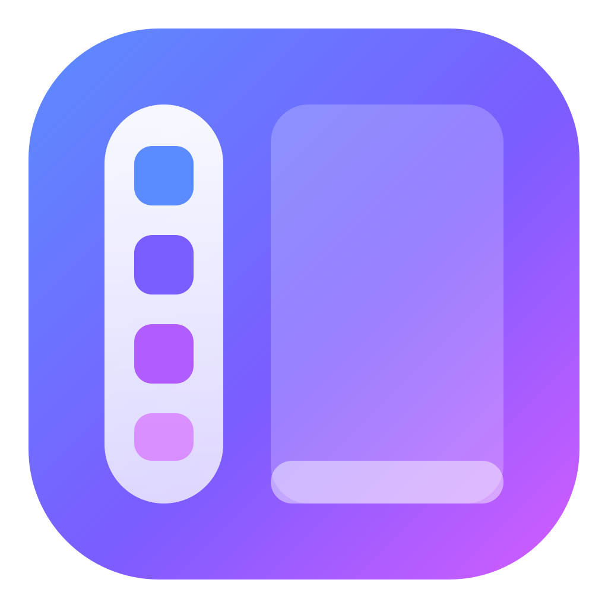

<p align="center">
  
</p>

<h1 align="center">SideDock</h1>

<p align="center">
  保留 Windows 原生任务栏的侧边停靠栏 · A side dock that keeps your Windows taskbar
</p>

---

SideDock 是一个 Windows 桌面停靠栏。它的停靠栏部分移植自
[Seelen UI](https://github.com/eythaann/Seelen-UI) 的 SeelenWeg，但 **不会隐藏系统任务栏**：
停靠栏可以放在屏幕左侧（或任意一边），原生任务栏依旧留在底部，两者同时存在。

## 功能

- **停靠栏**（完整移植自 Seelen UI）
  - 左 / 右 / 上 / 下四个位置，全屏宽度或按内容自适应
  - 自动隐藏：从不（像任务栏一样占用屏幕空间）/ 总是 / 与窗口重叠时，可调显示/隐藏延迟
  - 全屏应用（游戏、视频）处于前台时自动隐藏
  - 固定应用、文件、快捷方式；从资源管理器拖放即可固定；从 Windows 任务栏一键导入
  - 运行中的窗口按应用分组，打开/聚焦指示器，窗口计数，拆分窗口，窗口标题
  - 左中右三个分组 + 自定义分隔符，拖动排序，锁定任务栏
  - 类似 Mac 的波浪式放大：鼠标指向的图标放大并显示名称，前后图标平滑渐变
  - 应用太多时不再滚动：先缩小，再堆叠 / 继续缩小 / 折叠到“更多”按钮（可选）
  - 单击切换/最小化，多窗口弹出窗口列表，中键关闭或新建实例
  - 右键菜单：固定/取消固定、打开文件位置、以管理员身份运行、关闭、结束任务
  - 多显示器：仅主显示器或所有显示器
- **模块**：开始菜单、显示桌面、回收站、时钟与日历、键盘布局选择器、媒体播放器、
  电源与电池、蓝牙、网络、通知、任务管理器
- **主页 / 设置**：玻璃（毛）、玻璃（清）、暗色、亮色、跟随系统五种主题，自定义强调色，中英文切换，开机自启，
  日志 / 用户数据 / 缓存的查看与清理卡片
- **快捷键**：全局快捷键可自定义，录入时自动检测与 Windows 或其他程序的冲突
- **便携**：不写入 `C:\Users\...\AppData`，所有数据都在程序旁边的 `data` 文件夹

## 稳定性设计

| 场景 | 处理方式 |
| --- | --- |
| 多次双击启动 | 单实例锁，重复启动只会唤起已运行实例的设置窗口 |
| 连续快速点击 | 启动 / 电源等操作在后端做节流，窗口创建有防重入保护 |
| 强制结束 / 崩溃 | 守护进程释放停靠栏占用的屏幕空间，并自动重启（2 分钟内超过 3 次则停止） |
| 写配置时断电或被杀 | 原子写入（临时文件 + 重命名）并保留 `.bak`，损坏时自动回退 |
| 后台线程异常 | 监控线程出错会自动重启，不会拖垮整个程序 |
| 注销 / 关机 | 守护进程检测到系统正在关机时不会重新拉起 |

## 数据目录

```
SideDock.exe
data/
  config/    settings.json、dock_items.json（及 .bak 备份）
  logs/      滚动日志（每天一个，最多保留 10 个）
  userdata/  WebView2 配置文件
  cache/     应用图标缓存
  runtime/   会话锁、崩溃记录
```

唯一写入程序目录之外的内容是开机自启使用的注册表项
`HKCU\Software\Microsoft\Windows\CurrentVersion\Run\SideDock`（关闭开机自启即删除）。

## 使用

1. 从 Releases 下载 `SideDock_<版本>_x64_portable.zip`
2. 解压到任意 **你有写入权限** 的文件夹（例如 `D:\Apps\SideDock`）
3. 运行 `SideDock.exe`。首次运行会打开设置主页；之后可通过托盘图标打开

系统要求：Windows 10 / 11 x64，已安装 WebView2 Runtime（Windows 11 自带）。

## 开发

前置条件：Node.js 20+、Rust（stable）、Visual Studio 2022 C++ 生成工具。

```bash
npm install
npm run dev      # 开发模式（Vite 热重载 + Tauri）
npm run check    # 前端类型检查 + cargo check
npm run build    # 发布构建，输出到 release/
```

开发模式下数据写入仓库根目录的 `data/`（已被 git 忽略）。
可用环境变量 `SIDEDOCK_DATA_DIR` 指定其他数据目录。

项目结构见 [docs/ARCHITECTURE.md](docs/ARCHITECTURE.md)。

## 许可证

[GNU AGPL-3.0-or-later](LICENSE)。停靠栏的界面、状态逻辑与部分后端代码移植自
eythaann 的 [Seelen UI](https://github.com/eythaann/Seelen-UI)（同为 AGPL-3.0），
移植的文件在开头注明了来源。
